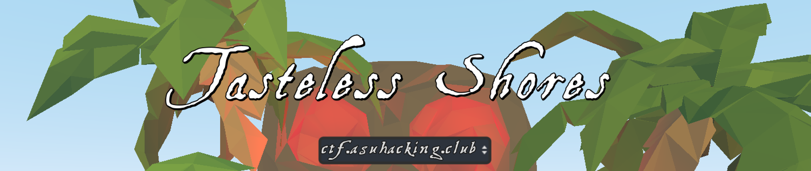
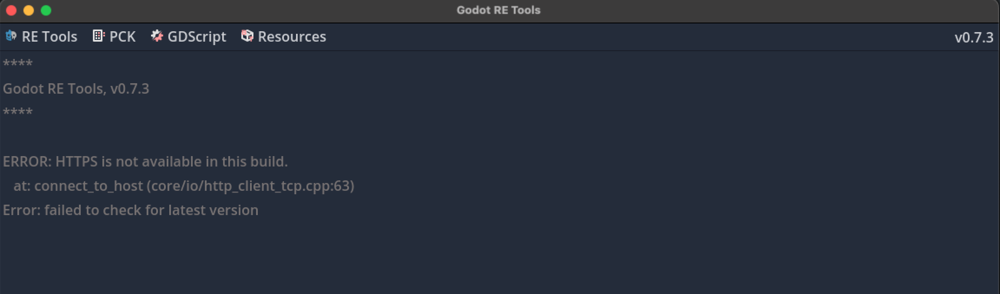
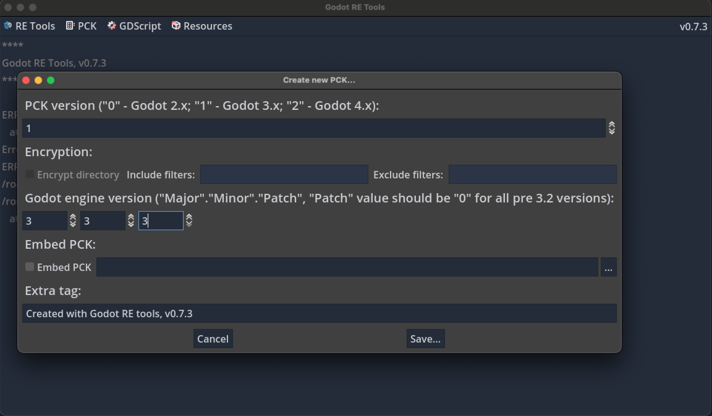

# Tasteless Shores Challenges



This a challenge repo for a reproduction of the popular Tasteless Shores challenge from the 2021 edition of Tasteless CTF.
There are **6** unique flags in this challenge, all of which involve fun game hacking. 

## Setup 
Clone this repo with all it's LFS objects (the big files):
```bash
git clone https://github.com/ASU-Hacking-Club/tasteless-shores-public.git
cd tasteless-shores-public 
git lfs fetch --all
git lfs checkout 
```
NOTE: due to git-lfs limits, we also have a copy of the .pck file hosted on [dropbox](https://www.dropbox.com/scl/fo/x5fet9ev40adv25zi9ev4/AIX0zk_hHyjYbymYkSorKaE?rlkey=zlul554ebbl1n5iplepy7cv88&st=f3vdh0z0&dl=0)!


You now have all files!

## Joining a Server
All the game files are in `handout`.
```bash
cd handout
```

Linux (`.x86_64`), Windows (`.exe`), and Mac (`.app`) clients can be found in this folder. 
Once you start the game, simplpy change the IP shown in the dropdown box the `ctf.asuhacking.club` one.
Then click join with a new username and password. 

### Linux
Below are extra instructions for running the Linux version.
You need to unzip the `tasteless-shores.pck.zip` file, then run the client in the **same directory**.
```
unzip tasteless-shores.pck.zip
./tasteless-shores.x86_64 client
```

Now your client should start! 

## Running Your Own Server
First have `docker` installsed on your machine.
Then run:
```
./start_challenge.sh
```

This will both build the Docker image (Ubuntu 22.04), and start running the server.
The game is now accessible on port 28. 
You can change the accessible port in the `start_challenge.sh` script you just ran. 

## Modifying Files
A part of this challenge is hacking the client! 
This can be annoying to do for the first time if you don't know the tools/how. 

First, download a Godot decompiler.
We use the [gdsdecomp](https://github.com/bruvzg/gdsdecomp/releases/tag/v0.8.0-prerelease.2) decompiler by `bruvzg`.
Launch it, then use the Recover Project option:
 

Recover it on the **unzipped** `.pck` file.
This will unpack the `.pck` and place it in a folder. 
You can now edit all files in there, which effect your client. 

When your edits are done, re-pack the project.
Use the `Pck` tab at the top. 
Select the unpacked folder you made earlier. 
Your options should look like this:


It's important that the top version is **1** and the Godot Engine version is **3.3.3**. 
That's it!
